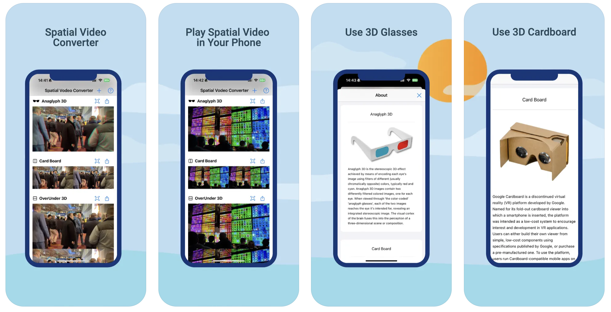

# Spatial Video Separate - Swift/SwiftUI

Separating right and left images in spatial video

## Introduction

Spatial Video is a 3D video supported by the iPhone 15 Pro and 15 Pro Max. If you have an iPhone 15 Pro or a Max, you can create Spatial Video. However, this video can only be played on Apple Vision Pro and Oculus.

The basic principle of Spatial Video is a method that utilizes the difference in vision between both eyes, so you can watch 3D videos in a regular video player by using 3D glasses that you are already using.

In this project, I implement the basic functionality to separate the left-eye image and the right-eye image in Spatial Video, providing the basic functionality to utilize the images.

## App 

You can download the app to create Anaglyph 3D, CardBoard 3D by separating Spatial Video from the link below.

[https://apps.apple.com/us/app/spatial-video-converter-pro/id6479389968](https://apps.apple.com/us/app/spatial-video-converter-pro/id6479389968)

## Requirements

- Xcode
- Swift
- SwiftUI
- AVFoundation
- AVKit
- iOS 17.2+

## Blog

[http://practical.kr/?p=768](http://practical.kr/?p=768)

## Contact

- billy park - [rtlink.park@gmail.com](rtlink.park@gmail.com)

## License

This project is licensed under the MIT License - see the [LICENSE.md](LICENSE.md) file for details

